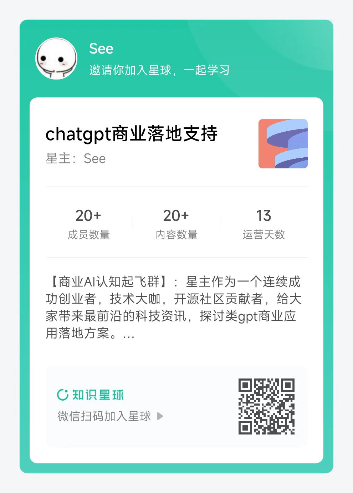

MiniGPT-4: 使用先进的大型语言模型增强视觉语言理解
作者为朱德尧、陈俊、沈晓倩、李翔和Mohamed Elhoseiny。*表示贡献相等。

所属机构为沙特阿拉伯国王科技大学。

## 在线演示

点击图像与MiniGPT-4聊天，了解有关您的图像的信息。
[](https://minigpt-4.github.io)

更多的例子可以在[项目页面](https://minigpt-4.github.io)中找到。

<a href='https://minigpt-4.github.io'></a>  <a href='MiniGPT_4.pdf'></a> <a href='https://huggingface.co/spaces/Vision-CAIR/minigpt4'></a> <a href='https://huggingface.co/Vision-CAIR/MiniGPT-4'></a> [](https://colab.research.google.com/drive/1OK4kYsZphwt5DXchKkzMBjYF6jnkqh4R?usp=sharing) [](https://www.youtube.com/watch?v=__tftoxpBAw&feature=youtu.be)

如果翻译对您有帮助，请帮忙右上角 点击 star.  
[欢迎加入国内AI商业应用交流群](#国内交流群)

---
## 新闻
我们现在提供了一个与Vicuna-7B对齐的预训练MiniGPT-4！演示GPU内存消耗现在可以低至12GB。


## 简介
- MiniGPT-4使用一个投影层来将来自BLIP-2的冻结视觉编码器与冻结的LLM Vicuna对齐。
- 我们通过两个阶段来训练MiniGPT-4。第一个传统的预训练阶段在使用4个A100大约10小时内，使用大约500万个图像-文本对进行训练。第一阶段过后，Vicuna能够理解图像。但是其生成能力受到了严重的影响。
- 为了解决这个问题和提高可用性，我们提出了一种通过模型和ChatGPT自身创建高质量图像-文本对的新方法。基于此，我们创建了一个小型（总共3500对）但是高质量的数据集。
- 第二个微调阶段在对话模板上使用该数据集进行训练，以显著提高其生成可靠性和整体可用性。令人惊讶的是，这个阶段具有计算效率，并且只需要使用单个A100大约7分钟的时间。
- MiniGPT-4能够产生许多类似于GPT-4中展示的新兴视觉语言能力。


入门指南：
### 安装

**1.准备代码和环境**

请先将我们的代码库克隆到本地，创建一个Python环境，然后通过以下命令激活它

```bash
git clone https://github.com/Vision-CAIR/MiniGPT-4.git
cd MiniGPT-4
conda env create -f environment.yml
conda activate minigpt4
```

**2.准备预训练的Vicuna权重**

当前版本的MiniGPT-4是建立在Vicuna-13B v0版本之上的。请参考我们的说明[here](PrepareVicuna.md)来准备Vicuna权重。

### here 的翻译如下：
如何准备Vicuna权重

Vicuna是一种基于LLAMA的LLM，性能接近于ChatGPT，并且是开源的。我们当前使用的是Vicuna-13B v0版本。

为了准备Vicuna的权重，首先从 https://huggingface.co/lmsys/vicuna-13b-delta-v0 下载Vicuna的增量权重。如果你已经安装了git-lfs（https://git-lfs.com）， 可以通过以下方式完成：

```bash
git lfs install
git clone https://huggingface.co/lmsys/vicuna-13b-delta-v0
```
请注意，这并不是直接可用的工作权重，而是工作权重与LLAMA-13B原始权重之间的差异（由于LLAMA的规则，我们无法分发LLAMA的权重）。

然后，您需要获取原始的LLAMA-13B权重，可以按照HuggingFace提供的说明[here](https://huggingface.co/transformers/model_doc/gpt2.html#transformers-gpt2-preprocessing-script)或者从互联网上下载。

### 原始权重获取如下：
提示：

可以通过填写表格来获取LLaMA模型的权重。你肯定不用填写，因为“热心网友”已经泄漏出来了
网址如下：https://github.com/facebookresearch/llama/issues/149

小白请推荐百度网盘 https://pan.baidu.com/s/1ujG85wgQFuIyf74N9k2MDQ?pwd=nu4d
不充会员的，可以使用 ipfs，或者迅雷。具体方法如下：

```
# 找到这个部分，你可以直接点击链接进入，使用迅雷下载。
Full backup: ipfs://Qmb9y5GCkTG7ZzbBWMu2BXwMkzyCKcUjtEKPpgdZ7GEFKm

7B: ipfs://QmbvdJ7KgvZiyaqHw5QtQxRtUd7pCAdkWWbzuvyKusLGTw 
13B: ipfs://QmPCfCEERStStjg4kfj3cmCUu1TP7pVQbxdFMwnhpuJtxk 
30B: ipfs://QmSD8cxm4zvvnD35KKFu8D9VjXAavNoGWemPW1pQ3AF9ZZ 
65B: ipfs://QmdWH379NQu8XoesA8AFw9nKV2MpGR4KohK7WyugadAKTh

也可以使用Kubo CLI中的以下命令：

# 可选：预加载 7B 模型。检索您尚未拥有的内容。如有需要，请替换为其他 CID。
ipfs refs -r QmbvdJ7KgvZiyaqHw5QtQxRtUd7pCAdkWWbzuvyKusLGTw

# 可选：固定7B模型。GC会删除您不使用的旧内容，这可以防止启用 GC 后模型被清除。
ipfs pin add QmbvdJ7KgvZiyaqHw5QtQxRtUd7pCAdkWWbzuvyKusLGTw

# 通过CLI从IPFS下载并保存到磁盘：
ipfs get QmbvdJ7KgvZiyaqHw5QtQxRtUd7pCAdkWWbzuvyKusLGTw --output ./7B

```
下载完成后，去百度网盘下载 tokenizer_checklist.chk tokenizer.model 这2个文件。 

文件夹结构如下：
```
.
├── 13B
│   ├── =
│   ├── checklist.chk
│   ├── consolidated.00.pth
│   ├── consolidated.01.pth
│   └── params.json
├── tokenizer_checklist.chk
└── tokenizer.model

```


下载完权重之后，需要使用转换脚本将它们转换为Hugging Face Transformers格式。可以使用以下命令（示例）调用脚本：
脚本地址：https://github.com/huggingface/transformers/blob/main/src/transformers/models/llama/convert_llama_weights_to_hf.py

```
# 转换之前，建议 安装环境依赖，否则转模型到一半会报错，及其浪费时间。

git clone https://github.com/lm-sys/FastChat
cd FastChat
pip install e .

pip install transformers[sentencepiece]

# 注意，这里，需要安装transforms 环境。国内 镜像源更新不及时，请使用原版pip源，或者直接从项目安装
其他依赖：如果出现timeout，可以使用魔法，或者版本不要求最新时，使用国内源


```
报错解决：
```
ValueError: Couldn't instantiate the backend tokenizer from one of:

https://stackoverflow.com/questions/65431837/transformers-v4-x-convert-slow-tokenizer-to-fast-tokenizer

pip install transformers[sentencepiece]

```


```bash
python src/transformers/models/llama/convert_llama_weights_to_hf.py \
    --input_dir /path/to/downloaded/llama/weights --model_size 7B --output_dir /output/path
```
注意替换上面的地址为你的文件系统的真实地址。   

转换完成后，可以通过以下方式加载模型和分词器：

```python
from transformers import LlamaForCausalLM, LlamaTokenizer

tokenizer = LlamaTokenizer.from_pretrained("/output/path")
model = LlamaForCausalLM.from_pretrained("/output/path")
```

当这两个权重准备好后，我们可以使用Vicuna团队的工具来创建真正的工作权重。首先，安装与v0 Vicuna兼容的库：

```bash
pip install git+https://github.com/huggingface/transformers@v0.1.10
```

然后，运行以下命令以创建最终的工作权重：

```bash
python -m fastchat.model.apply_delta --base /path/to/llama-13b-hf/  --target /path/to/save/working/vicuna/weight/  --delta /path/to/vicuna-13b-delta-v0/
```

现在，您可以准备好使用Vicuna权重了！


最终得到的权重文件应该放在一个文件夹内，具有以下结构：

```
vicuna_weights
├── config.json
├── generation_config.json
├── pytorch_model.bin.index.json
├── pytorch_model-00001-of-00003.bin
...   
```

然后，在模型配置文件[here](minigpt4/configs/models/minigpt4.yaml#L16)的第16行设定vicuna权重的路径。

**3. 准备预训练的MiniGPT-4检查点**

根据您准备的Vicuna模型下载预训练检查点。

|                                Checkpoint Aligned with Vicuna 13B                                |                               Checkpoint Aligned with Vicuna 7B                                |
:------------------------------------------------------------------------------------------------:|:----------------------------------------------------------------------------------------------:
 [下载](https://drive.google.com/file/d/1a4zLvaiDBr-36pasffmgpvH5P7CKmpze/view?usp=share_link) | [下载](https://drive.google.com/file/d/1RY9jV0dyqLX-o38LrumkKRh6Jtaop58R/view?usp=sharing) 


然后，在评估配置文件[minigpt4_eval.yaml](eval_configs/minigpt4_eval.yaml#L10)的第11行中设置预训练检查点的路径。

### 在本地启动演示

通过运行以下命令在本地机器上试用我们的演示[demo.py](demo.py)：

```
python demo.py --cfg-path eval_configs/minigpt4_eval.yaml  --gpu-id 0
```

为了节省GPU内存，Vicuna默认为8位加载，搜索宽度为1。
该配置需要大约23G的GPU内存用于Vicuna 13B和11.5G的GPU内存用于Vicuna 7B。
对于更强大的GPU，您可以在配置文件[minigpt4_eval.yaml](eval_configs/minigpt4_eval.yaml)中将low_resource设置为False并使用更大的搜索宽度以16位运行模型。

感谢@WangRongsheng，您也可以在[Colab](https://colab.research.google.com/drive/1OK4kYsZphwt5DXchKkzMBjYF6jnkqh4R?usp=sharing)上运行我们的代码。
### 训练
MiniGPT-4的训练包含两个对齐阶段。

**1. 第一阶段预训练**

在第一个预训练阶段中，使用来自Laion和CC数据集的图像文本对训练模型，
以对齐视觉和语言模型。要下载和准备数据集，请查看我们的[第一阶段数据集准备说明](dataset/README_1_STAGE.md)。
在第一阶段之后，视觉特征被映射并可以被语言模型理解。
要启动第一阶段训练，请运行以下命令。在我们的实验中，我们使用了4个A100。
您可以在配置文件[train_configs/minigpt4_stage1_pretrain.yaml](train_configs/minigpt4_stage1_pretrain.yaml)中更改保存路径。

```bash
torchrun --nproc-per-node NUM_GPU train.py --cfg-path train_configs/minigpt4_stage1_pretrain.yaml
```

只有第一阶段训练的MiniGPT-4检查点可在此处下载
[here](https://drive.google.com/file/d/1u9FRRBB3VovP1HxCAlpD9Lw4t4P6-Yq8/view?usp=share_link)。
与第二阶段之后的模型相比，此检查点经常生成不完整和重复的句子。


**2. 第二阶段微调**

在第二个阶段中，我们使用自己创建的小型高质量图像文本对数据集，并将其转换为对话格式，以进一步对齐MiniGPT-4。
要下载和准备我们的第二阶段数据集，请查看我们的[第二阶段数据集准备说明](dataset/README_2_STAGE.md)。
要启动第二阶段对齐，请先在[train_configs/minigpt4_stage2_finetune.yaml](train_configs/minigpt4_stage2_finetune.yaml)中指定第1阶段训练的检查点文件的路径。
您也可以在那里指定输出路径。
然后，运行以下命令。在我们的实验中，我们使用1个A100。

```bash
torchrun --nproc-per-node NUM_GPU train.py --cfg-path train_configs/minigpt4_stage2_finetune.yaml
```

经过第二阶段的对齐，MiniGPT-4能够以连贯且易于使用的方式讨论图像。

## 致谢

+ [BLIP2](https://huggingface.co/docs/transformers/main/model_doc/blip-2) ：MiniGPT-4的模型架构遵循BLIP-2。如果您以前不知道它，请不要忘记检查这个伟大的开源工作！
+ [Lavis](https://github.com/salesforce/LAVIS) ：这个存储库是基于Lavis构建的！
+ [Vicuna](https://github.com/lm-sys/FastChat) ：只有13B个参数的Vicuna的神奇语言能力真是太棒了。它是开源的！

如果您在研究或应用中使用MiniGPT-4，请引用以下BibTeX：

```bibtex
@misc{zhu2022minigpt4,
      title={MiniGPT-4: Enhancing Vision-language Understanding with Advanced Large Language Models}, 
      author={Deyao Zhu and Jun Chen and Xiaoqian Shen and xiang Li and Mohamed Elhoseiny},
      year={2023},
}
```

## 国内交流群
群主会不定期发布 各类亮眼项目体验版本 供大家体验，星球主要沉淀一些商业AI最新讯息，帮助大家节约时间。欢迎各位读者老爷，漂亮姐姐给我的项目点赞！

|              关注公众号加群               |                      知识星球                       |
|:-------------------------------:|:-----------------------------------------------:|
|  |   |

## 许可证.  
此存储库采用[BSD 3-Clause许可证](LICENSE.md)。   
许多代码基于[Lavis](https://github.com/salesforce/LAVIS)，这里是BSD 3-Clause许可证[here](LICENSE_Lavis.md)。   

## 感谢
本项目 fork 自 https://github.com/Vision-CAIR/MiniGPT-4
大部分翻译来自 https://github.com/Vision-CAIR/MiniGPT-4
